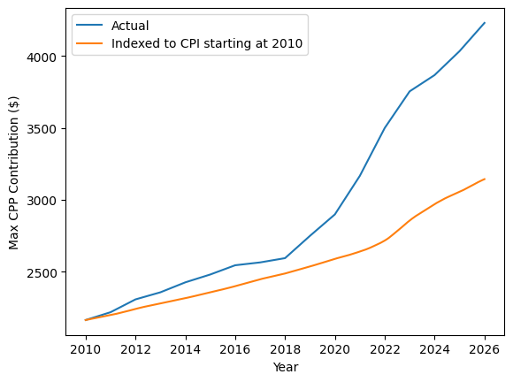

# 

## Objective
Learn a bit about:
- Text files that don't magically import
- Converting from text to datetime and numeric formats

## Setup
Update your labs repo through the usual method. There is one starter notebook with guiding `TODO` comments and some data files.

## Your task
This activity was inspired by a friend who complained that Canada Pension Plan (CPP) contribution maximums have been outpacing inflation (yes, this is very much a first world problem). The [CPP website](https://www.canada.ca/en/revenue-agency/services/tax/businesses/topics/payroll/payroll-deductions-contributions/canada-pension-plan-cpp/cpp-contribution-rates-maximums-exemptions.html) provides information in tabular form, but it's nice to interpret it visually.

To create a nice pretty plot, I downloaded the CSV from the CPP website and the consumer price index (CPI) data from the [Bank of Canada](https://www.bankofcanada.ca/rates/price-indexes/cpi/) to compare to inflation. Lo and behold, the first thing I encountered was an encoding error! How timely.

Following the `TODO` items in the starter notebook, load the CPP contribution data and CPI data and create the following plot:



Turns out my friend was right and the maximum contribution has gone up compared to inflation!

## Submit
As usual, commit and push your changes so I can take a peek and give you feedback (and that 1% completion grade).

## Optional extra: Web parsing
> This is an optional activity, you'll do a lot more web scraping in DATA 3463

The main task of this lab is fairly small once you figure out how to load the text files and convert to appropriate datatypes. If you want to take it a step further, you might notice that the tables on the [CPP website](https://www.canada.ca/en/revenue-agency/services/tax/businesses/topics/payroll/payroll-deductions-contributions/canada-pension-plan-cpp/cpp-contribution-rates-maximums-exemptions.html) provide more years of data than the CSV. Perhaps it would make sense to parse directly from the HTML!

Here's a bit of parsing code to get you started, using the popular [BeautifulSoup](https://www.crummy.com/software/BeautifulSoup/) package.

```python
from bs4 import BeautifulSoup
import requests
from pathlib import Path

# Save the file the first time, then load from disk in subsequent runs
cpp_file = Path("cpp.html")
if not cpp_file.exists():
    r = requests.get("https://www.canada.ca/en/revenue-agency/services/tax/businesses/topics/payroll/payroll-deductions-contributions/canada-pension-plan-cpp/cpp-contribution-rates-maximums-exemptions.html")
    if r.status_code == 200:
        html = r.text
        with open(cpp_file, "w", encoding="utf-8") as f:
            f.write(html)
else:
    with open(cpp_file, "r", encoding="utf-8") as f:
        html = f.read()

soup = BeautifulSoup(html)
```

Once you've got the "soup" describing the website, you can find specific html elements, e.g.:

```python
for table in soup.find_all("table"):
    print(table)
```