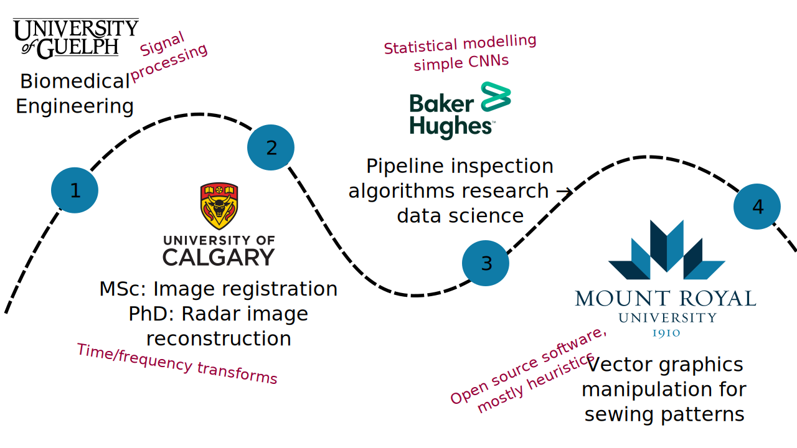
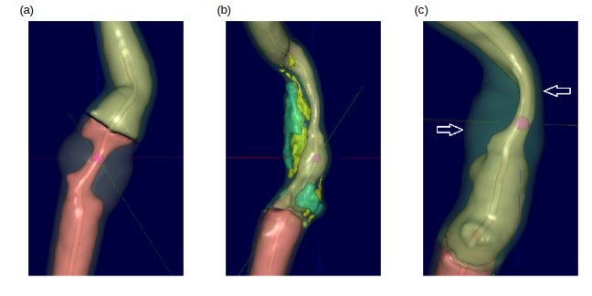

<!-- 
_class: title_slide
_paginate: skip
-->

{}

# <!--fit-->DATA 3464: Fundamentals of Data Processing
### <!--fit-->Intro to the course

Charlotte Curtis
January 6, 2026

{}

## Meet your instructor

**Name:** Charlotte Curtis

**Pronouns:** She/her

**Office:** B102-4

**Email:** ccurtis@mtroyal.ca

**Office hours:** [Book here](https://calendar.google.com/calendar/u/0/appointments/AcZssZ1DErlRJ8cNGFn27y-fiFzPEXgDKu8r7LXkGOY=)

## My Background

## Another new class!
> [!NOTE]
> This course introduces techniques for ethically and responsibly **wrangling** and manipulating datasets to make them appropriate for addressing the question at hand. Topics may include cleaning and transforming data, integrity and quality measures, common file formats, feature selection and engineering, and generating features from unstructured sources such as text and images.

## Grade Assessment

| Component          | Weight  |
| ------------------ | ------- |
| Tutorial exercises | 10%     |
| Assignments        | 3 x 10% |
| Midterm exam       | 25%     |
| Final project      | 35%     |

Bonus marks may be awarded for *substantial* corrections to materials, submitted as pull requests

**Source repo**: https://github.com/mru-data3464/w26

**Rendered at**: https://mru-data3464.github.io/w26

## Textbook(s)

Open source resources: 
- http://www.feat.engineering/
- All the documentation!
    - [Pandas](https://pandas.pydata.org/docs/)
    - [Numpy](https://numpy.org/doc/stable/)
    - [SciPy](https://scipy.github.io/devdocs/)
    - [Matplotlib](https://matplotlib.org/stable/users/index.html)
- ... or the [R tidyverse](https://tidyverse.org/)

> [!TIP]
> Don't just rely on AI summaries!

## The "plan" - before Reading Week

| Week | Topic                                  | Chapter (ish) |
| ---- | -------------------------------------- | ------------- |
| 1    | Review and planning                    | 1-2           |
| 2    | Exploring data, sampling, splitting    | 3-4           |
| 3    | Representing categorical data          | 5             |
| 4    | Numeric transformations, too much data | 6             |
| 5    | Dealing with missing values            | 7-8           |
| 6    | Feature selection                      | 10            |

## The "plan" - after Reading Week

| Week | Topic                                | Resources     |
| ---- | ------------------------------------ | ------------- |
| 7    | Midterm                              |               |
| 8    | Extracting data from text            |               |
| 9    | Image representation and processing  |               |
| 10   | Data labelling and augmentation      |               |
| 11   | Processing pipelines                 |               |
| 12   | Supervised and unsupervised learning |               |
| 13   | Buffer                               |               |

## Core courses so far

## What do you know about...
* Various probability distributions
* Linear and logistic regression
* Data quality measures
* Data stewardship best practices
* Document parsing, web scraping, audio/video feature detection
* Linear algebra and array programming
* Prediction tasks: classification and regression
* Clustering and anomaly detection
* Evaluation metrics
* Basic data visualization (scatter plots, histograms, etc)

## What do you want to know about?

### Examples of Subject Matter
- Finance
- Real estate
- Transportation
- Climate
- Politics
- Biology
- Chemistry
- Malware

### Examples of Data types
- Unstructured text
- Structured text (e.g. csv, HTML)
- PDF
- Word documents
- Images
- Audio
- Video

## Case study: Risk of Ischemic Stroke

Chapter 2: http://www.feat.engineering/stroke-tour

* Arterial stenosis can predict risk
* Plaque composition plays a role
* Features extracted from CT images
* Other risk factors (demographics, lifestyle) added to dataset

## Load and set aside test data