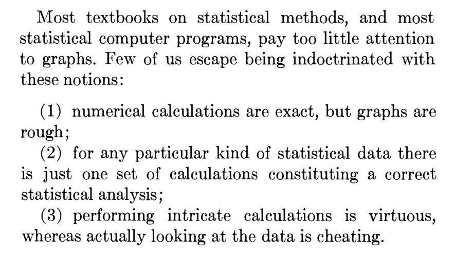

<!-- 
_class: title_slide
_paginate: skip
-->


{}

# <!--fit-->DATA 3464: Fundamentals of Data Processing
### <!--fit-->Basic machine learning models

Charlotte Curtis
January 13, 2026

{}

## This week's topics
- Exploring and understanding your data
- Splitting your data
- Assignment 1: Exploring Calgary traffic data

**Resources used**:

## Basic things to look at
- Data source - File? Database? API? 
- Structured/unstructured
- Assumption 1: relatively small (fits in memory) tabular dataset
  - Data types - numeric/categorical, text, other
  - Assumption 2: numeric data 
    - Ranges
    - Summary statistics
    - Missing values
- Next week: categorical data, after reading week unstructured

## Example: Anscombe's Quartet
<!-- _class: code_reminder -->
- Very small dataset, constructed by hand in 1973 by [Francis Anscombe](https://www.jstor.org/stable/2682899?seq=1)

- Not known exactly how he made it, but Drs. Roberta La Haye and Peter Zizler proposed a [compelling argument](https://www.tandfonline.com/doi/full/10.1080/07468342.2024.2385078) for linear algebra

## Useful starting points
<!-- _class: code_reminder -->
- [`pandas.DataFrame.info`](https://pandas.pydata.org/pandas-docs/stable/reference/api/pandas.DataFrame.info.html): data type, number of non-null, names, dimensions
- [`pandas.DataFrame.head`](https://pandas.pydata.org/pandas-docs/stable/reference/api/pandas.DataFrame.head.html): return the first `n` rows (default 5)
- [`pandas.DataFrame.describe`](https://pandas.pydata.org/pandas-docs/stable/reference/api/pandas.DataFrame.describe.html): Compute a bunch of summary statistics
- As soon as you have a general sense of the:
  - Data scales
  - Missing features
  - Distributions, particularly categorical
- It's time to split the data!

## Splitting your data - why

- We need to set aside a final **test set** to evaluate our final model
- Humans are great at detecting patterns!
- Even looking at test data could influence decisions, causing **data leakage**

## Splitting your data - how

<!-- _class: code_reminder -->

## Types of exploratory visualizations
- I will not provide an exhaustive list of visualizations!
- Pandas provides a [handy wrapper](https://pandas.pydata.org/pandas-docs/stable/user_guide/visualization.html) around [matplotlib](https://matplotlib.org/)
- So does [Seaborn](https://seaborn.pydata.org/) - check out the [example gallery](https://seaborn.pydata.org/examples/index.html)
- Some of my favourites:
  - Histograms
  - Scatter plots/hexbin plots
  - Box plots/violin plots

## Some simple tricks
<!--
  _class: code_reminder 
-->

Try tweaking:

- Histogram bin sizes
  - Aiming for a smooth distribution that works for your data
- Transparency (`alpha`)
  - Useful for both dense scatter plots and overlapping categories
- "Jitter"
  - Mostly for scatter plot of continuous vs categorical data
  - Add a tiny bit of random noise to spread out samples