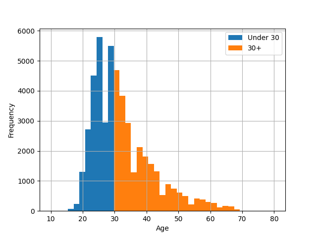

<!-- 
_class: title_slide
_paginate: skip
-->


{}

## <!--fit-->DATA 3464: Fundamentals of Data Processing
### <!--fit-->Categorical Data

Charlotte Curtis
January 22, 2026

{}

## Topic overview
- Exploring categorical data
- Categorical data encoding strategies

**Resources used:**
- [Feature Engineering Chapter 5](http://www.feat.engineering/encoding-categorical-predictors)
- [Scikit-learn User Guide (7.3)](https://scikit-learn.org/stable/modules/preprocessing.html#encoding-categorical-features)

## What is categorical data?
- Samples can take on one of several discrete values or groups
    - **Nominal**: no particular order to the groups
    - **Ordinal**: groups relate to each other in a specific order
- Categories can be represented as strings *or* numeric types
    - Domain knowledge is necessary!

> Let's take a few minutes to brainstorm some examples

## Exploring categorical data
<!-- _class: code_reminder -->

We've already done some of this, but some ideas to consider:
- `pandas.DataFrame.value_counts()` - how many of each category?
- Use category to group, then compute summary stats
- Plot color per category
- Scatter plot with jitter

## Representing categorical data
- Tree-based models can handle string-based categories as-is
- Most other models need numbers
- Consider:
    - Ordinal or nominal?
    - How many possible categories (cardinality)?
    - Any chance new ones might show up?

> How could we encode the examples?
> What are the benefits and drawbacks of each method?

## Ordinal encoding

<!-- _class: code_reminder -->

  | Category  | Feature |
  | --------- | ------- |
  | Nil       | 0       |
  | Low       | 1       |
  | Moderate  | 2       |
  | High      | 3       |
  | Very High | 4       |
  | Extreme   | 5       |

<footer>Image source: <a href="https://cwfis.cfs.nrcan.gc.ca/maps/fw">Natural Resources Canada</a></footer>

<!-- 
Drawbacks
- Only useful for naturally ordered data
- Assumes linear relationship
- Difficult to deal with novel features
-->

## Nominal categories: one-hot encoding
<!-- _class: code_reminder -->
- Categories have no natural relationship
- Create $k$ new features from $k$ categories, very sparse matrix

| Animal |     | cat | dog | rabbit |
| ------ | --- | --- | --- | ------ |
| cat    | →   | 1   | 0   | 0      |
| dog    | →   | 0   | 1   | 0      |
| rabbit | →   | 0   | 0   | 1      |

<!-- 
Drawbacks
- Not good for high cardinality -> consider feature hashing or combining categories
- Collinearity issues -> (if a concern for model) dummy encoding instead with drop
- Novel features -> implied by 0 if not using dummy, could also define "other" category
-->

## Another approach: target encoding
<!-- _class: code_reminder -->
- Basic concept: replace the category with the mean of the target
- Essential to avoid data leakage!
- Example: predicting weight of animal

| Animal |     | mean_kg |
| ------ | --- | ------- |
| cat    | →   | 4.1     |
| dog    | →   | 15.4    |
| rabbit | →   | 2.2     |

<!--
Drawbacks
- Doesn't work for unsupervised
- Loss of relationship with other features
- Mean is not great for categories with few examples
-->

## Getting fancy with feature hashing
<!-- _class: code_reminder -->
- Good if you have too many categories, or combinations of categories
- Converts each category into a fixed-length feature vector

| Animal |     | A_0 | A_1 | A_2 | ... | A_16 |
| ------ | --- | --- | --- | --- | --- | ---- |
| cat    | →   | 1   | 0   | 0   | ... | 1    |
| dog    | →   | 0   | 1   | 0   | ... | 1    |
| rabbit | →   | 1   | 0   | 1   | ... | 0    |

> Even fancier methods exist, like [supervised encoding methods](http://www.feat.engineering/categorical-supervised-encoding) which basically train a model-within-a-model

## From numbers to categories: discretization

- Sometimes numeric data is better represented as categorical
- Still needs encoding strategy
- Can introduce nonlinear relationships
- Like everything, contextual

## Coming up next
- Assignment 1 due next week
- Lab: practice with modelling process

> [Feature Engineering Chapter 5](http://www.feat.engineering/encoding-categorical-predictors)
