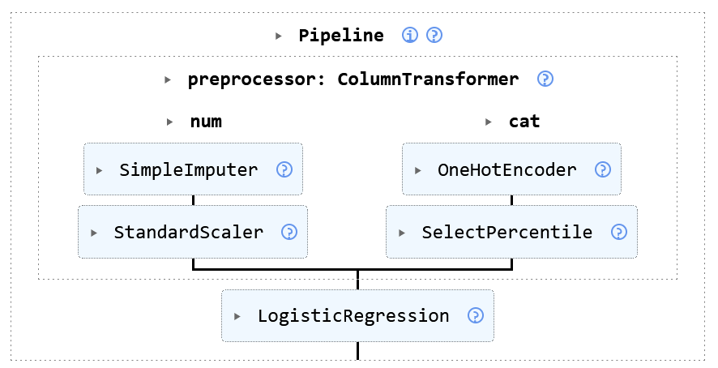

<!-- 
_class: title_slide
_paginate: skip
-->


{}

## <!--fit-->DATA 3464: Fundamentals of Data Processing
### <!--fit-->Numeric Data Transformations

Charlotte Curtis
January 27, 2026

{}

## Topic overview
- Why transformations are necessary
- Common transformations
- Dimensionality reduction

**Resources used:**
- [Feature Engineering Chapter 6](http://www.feat.engineering/engineering-numeric-predictors)
- Hands on Machine Learning with Scikit-Learn and Tensorflow/PyTorch, Chapter 4. Available at [MRU Library](https://ebookcentral.proquest.com/lib/mtroyal-ebooks/detail.action?docID=30168989)
- [Scikit-learn user guide: Chapter 7](https://scikit-learn.org/stable/data_transforms.html)
- Introduction to Machine Learning with Python. Available at <a href="https://librarysearch.mtroyal.ca/permalink/01MTROYAL_INST/1qa1aqk/cdi_overdrive_books_ODN0002976888">MRU Library</a>

## Common 1:1 transformations

> "Most models work best when each feature (and in regression also the target) is loosely Gaussian distributed" -- Introduction to Machine Learning with Python

- Scaling: normalization or standardization
- Nonlinear transforms: log, square root, polynomial
- Fancier methods: Box-Cox, Yeo-Johnson

## A brief intro to gradient descent
- Many linear models minimize some cost function through **gradient descent**
- The **gradient** is a vector of partial derivatives
    $$\nabla f = \begin{bmatrix} \frac{\partial f}{\partial x_1} \\ \frac{\partial f}{\partial x_2} \\ \vdots \\ \frac{\partial f}{\partial x_n} \end{bmatrix}$$

  for some scalar-valued $f(\mathbf{x})$

## Descending the gradient
For a loss (or cost) function such as $MSE(\mathrm{\theta}) = \frac{1}{m}(\mathbf{X}\mathbf{\theta} - \mathbf{y})^T(\mathbf{X}\mathbf{\theta} - \mathbf{y})$
1. Start with a random $\mathbf{\theta}$
2. Calculate the gradient $\nabla_{\mathbf{\theta}}$ for the current $\mathbf{\theta}$
3. Update $\mathbf{\theta}$ as $\mathbf{\theta} = \mathbf{\theta} - \eta \nabla_{\mathbf{\theta}}$
4. Repeat 2-3 until some stopping criterion is met

    where $\eta$ is the **learning rate**, or the size of step to take in the direction opposite the gradient.

## Visualizing in 2D
- The gradient has $m + 1$ dimensions, where $m$ is the number of features
- step size $\eta$ is a scalar parameter


> Main takeaway: feature should be more or less on the same scale

<footer>Figure 4-7 from Hands-on Machine Learning</footer>

## Approaches to scaling


<div class="columns">

Standardize: $x_{scaled} = \dfrac{x - \mu_x}{\sigma_x}$ 

Normalize: $x_{scaled} = \dfrac{x - \mathrm{min}(x)}{\mathrm{max}(x) - \mathrm{min}(x)}$ 

</div>

## Nonlinear transforms

<!-- _class: code_reminder -->


- Common case: count data
- Example: Ask 1000 students how often they checked D2L that day
- Not a Gaussian distribution!
- What about the central limit theorem?

## Where we left off on January 27
<!-- 
_class: title_slide
_paginate: skip 
-->

## Transformations in training vs inference
- Define functions, e.g.
  ```python
  def standardize(X, mu, sigma):
      return (X - mu) / sigma
  ```
- Compute scaling parameters **on the training data**, then stash them somewhere:
  ```python
  mu = X_train.mean()
  sigma = X_train.std()
  # ... later on, during inference
  X = standardize(X, mu, sigma)
  ```
  > What would happen if `standardize` instead computed values on the fly?
  > What else am I missing here?

## Manual approach in the wild
You may run across [magic numbers](https://en.wikipedia.org/wiki/Magic_number_(programming)), e.g from the [PyTorch tutorials](https://docs.pytorch.org/tutorials/beginner/data_loading_tutorial.html):

  ```python
  import torch
  from torchvision import transforms, datasets

  data_transform = transforms.Compose([
          transforms.RandomResizedCrop(224),
          transforms.RandomHorizontalFlip(),
          transforms.ToTensor(),
          transforms.Normalize(mean=[0.485, 0.456, 0.406],
                               std=[0.229, 0.224, 0.225])
      ])
  ```
This really should have a comment! Derived from [ImageNet](https://www.image-net.org/index.php).

## An alternative solution: Scikit-learn `Pipeline`s
<!-- 
_class: code_reminder 
-->
- Hard-coding scaling (and other) parameters is okay, provided you can **justify the choice** and **document where they came from**
- Scikit-learn has a handy [Pipeline](https://scikit-learn.org/stable/modules/generated/sklearn.pipeline.Pipeline.html) class that handles this for you
- Each step in the pipeline has a `fit` and `transform` method
  - `fit` computes parameters from the training data
  - `transform` applies the transformation
  - `fit_transform` does both -- **only use on training data!**
- You can call these functions on the whole pipeline to fit or apply all in one go

## Different processing for different features
<!-- _class: code_reminder -->
- Linear pipelines are great for doing the same thing to multiple features
- Most of the time, different features need different processing
- We can use a [ColumnTransformer](https://scikit-learn.org/stable/modules/generated/sklearn.compose.ColumnTransformer.html) to split the pipeline
  
<footer>From Scikit-learn <a href="https://scikit-learn.org/stable/auto_examples/compose/plot_column_transformer_mixed_types.html">Column transformer</a> example.</footer>