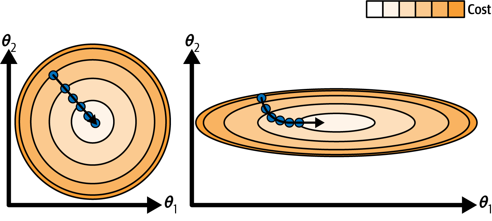
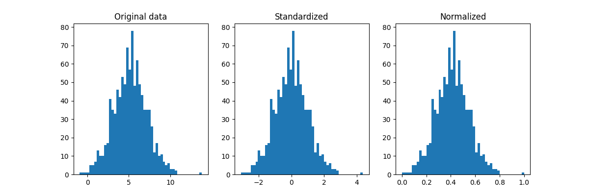
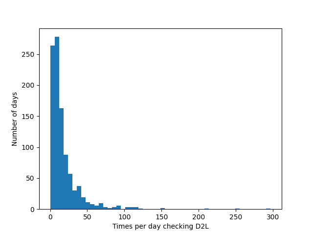

<!-- 
_class: title_slide
_paginate: skip
-->


{}

## <!--fit-->DATA 3464: Fundamentals of Data Processing
### <!--fit-->Numeric Data Transformations

Charlotte Curtis
January 27, 2026

{}

## Topic overview
- Why transformations are necessary
- Common transformations
- Dimensionality reduction

**Resources used:**
- [Feature Engineering Chapter 6](http://www.feat.engineering/engineering-numeric-predictors)
- Hands on Machine Learning with Scikit-Learn and Tensorflow/PyTorch, Chapter 4. Available at [MRU Library](https://ebookcentral.proquest.com/lib/mtroyal-ebooks/detail.action?docID=30168989)
- [Scikit-learn user guide: Chapter 7](https://scikit-learn.org/stable/data_transforms.html)
- Introduction to Machine Learning with Python. Available at <a href="https://librarysearch.mtroyal.ca/permalink/01MTROYAL_INST/1qa1aqk/cdi_overdrive_books_ODN0002976888">MRU Library</a>

## Common 1:1 transformations

> "Most models work best when each feature (and in regression also the target) is loosely Gaussian distributed" -- Introduction to Machine Learning with Python

- Scaling: normalization or standardization
- Nonlinear transforms: log, square root, polynomial
- Fancier methods: Box-Cox, Yeo-Johnson

## A brief intro to gradient descent
- Many linear models minimize some cost function through **gradient descent**
- The **gradient** is a vector of partial derivatives
    $$\nabla f = \begin{bmatrix} \frac{\partial f}{\partial x_1} \\ \frac{\partial f}{\partial x_2} \\ \vdots \\ \frac{\partial f}{\partial x_n} \end{bmatrix}$$

  for some scalar-valued $f(\mathbf{x})$

## Descending the gradient
For a loss (or cost) function such as $MSE(\mathrm{\theta}) = \frac{1}{m}(\mathbf{X}\mathbf{\theta} - \mathbf{y})^T(\mathbf{X}\mathbf{\theta} - \mathbf{y})$
1. Start with a random $\mathbf{\theta}$
2. Calculate the gradient $\nabla_{\mathbf{\theta}}$ for the current $\mathbf{\theta}$
3. Update $\mathbf{\theta}$ as $\mathbf{\theta} = \mathbf{\theta} - \eta \nabla_{\mathbf{\theta}}$
4. Repeat 2-3 until some stopping criterion is met

    where $\eta$ is the **learning rate**, or the size of step to take in the direction opposite the gradient.

## Visualizing in 2D
- The gradient has $m + 1$ dimensions, where $m$ is the number of features
- step size $\eta$ is a scalar parameter

> Main takeaway: feature should be more or less on the same scale

<footer>Figure 4-7 from Hands-on Machine Learning</footer>

## Approaches to scaling

Standardize: $x_{scaled} = \dfrac{x - \mu_x}{\sigma_x}$ 

Normalize: $x_{scaled} = \dfrac{x - \mathrm{min}(x)}{\mathrm{max}(x) - \mathrm{min}(x)}$ 

## Nonlinear transforms

- Common case: count data
- Example: how often do you check D2L throughout the semester?
- Not a Gaussian distribution!