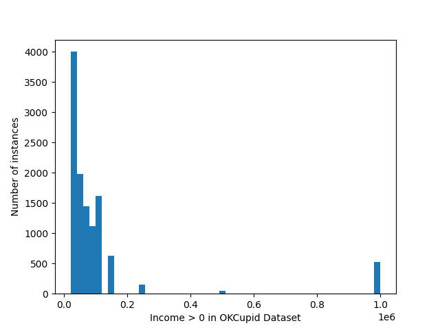
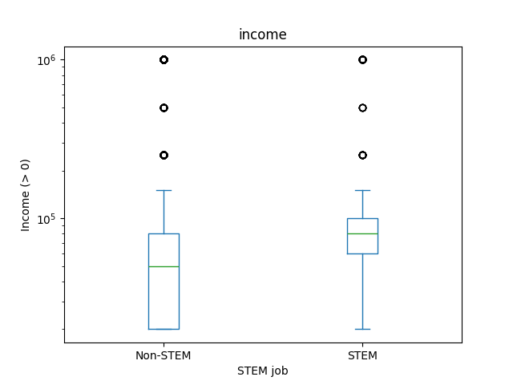
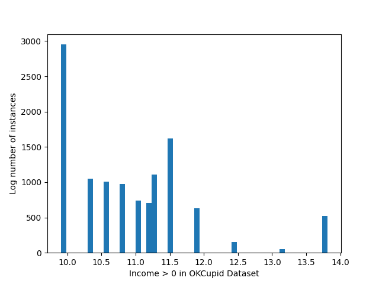

<!-- 
_class: title_slide
_paginate: skip
-->


{}

## <!--fit-->DATA 3464: Fundamentals of Data Processing
### <!--fit-->Missing and weird data

Charlotte Curtis
February 5, 2026

{}

## Topic overview
- What to do with missing data
- Detecting and handling outliers

**Resources used:**
- [Feature Engineering Chapter 8](http://www.feat.engineering/handling-missing-data)
- Hands on Machine Learning with Scikit-Learn and Tensorflow/PyTorch, Chapter 2. Available at [MRU Library](https://ebookcentral.proquest.com/lib/mtroyal-ebooks/detail.action?docID=30168989)
- [Scikit-learn user guide: Chapters 2 and 7](https://scikit-learn.org/stable/user_guide.html)

## The problem
- As you've seen, real-world data is messy
- Missing values are common, other values don't make sense
- We need to decide how to deal with these problems

> What examples have we seen so far?
> Why might data be missing or weird*?

\*I'm using "weird" as an informal catch-all for unexpected or outlier values

<!-- 
- OKCupid dataset: negative values for income, placeholders in categories
- Property assessments: very low property values
- Traffic dataset: some streets have no speed limit
 -->

## Missing data

<!-- _class: code_reminder -->

When data are missing in the *features* we have a few options:

0. Do nothing! Some algorithms (e.g. [Decisions Trees](https://scikit-learn.org/stable/modules/tree.html#tree-missing-value-support)) can handle missing values
1. Remove *features* with missing values
2. Remove *samples* with missing values
3. Invent a new value to represent "missingness"
4. **Impute** a value based on other data

> Most important: understand *why* data are missing (more EDA!)

<!-- Reminder of rows vs columns -->

## Option 1: removing features
- If a feature has:
    - A high proportion of missing values, *and*
    - Little apparent relationship to the target *or*
    - its information is redundant with other features
- It may be reasonable to remove it entirely. You can drop it, e.g.:
    ```python
    df.drop(columns=['feature_name'], inplace=True)
    ```
    or (probably more reliable) just not select it when building your pipeline

## Option 2: removing samples
- If only a small number of samples have missing values, you can drop them **from the training data**:
    ```python
    train.dropna(subset=[["features","we","care","about"]], inplace=True)
    ```
- Good idea if the same samples have missing values from multiple features
- Still useful to explore *why* data are missing

> What should we do for inference?

## Option 3: invent a new value
- Categorical features: add a new category for "missing"
- Add a new binary feature indicating whether the value was missing
- I have seen advice to use extreme values for numerical features, like the -1 income in the OKCupid dataset, but I'm not convinced this is a good idea

> [Case study](http://www.feat.engineering/encoding-missingness): where missingness is informative

## Option 4: impute missing values
<!-- _class: code_reminder -->

- Fill in the missing values with an "educated guess"
- Replace missing value with:
    - constant
    - mean, median, or mode (`most_frequent`)
- Use other features to infer missing value:
    - K-nearest neighbours
    - simple models to predict missing values
- Can be combined with option 3 to [indicate missing features](https://scikit-learn.org/stable/modules/impute.html#marking-imputed-values)
- How much to impute? [Feat.Engineering](http://www.feat.engineering/imputation-methods) suggests no more than 20%

## Choosing an imputation strategy

| Strategy              | When to use                               |
| --------------------- | ----------------------------------------- |
| Constant              | When there is a reasonable default value  |
| Mean                  | Numeric features with normal distribution |
| Median                | Numeric features with extreme outliers    |
| KNN                   | Relationship with other features          |
| Missingness indicator | If missingness seems informative          |

## Outliers

> An outlier is an observation which deviates so much from the other observations as to arouse suspicions that it was generated by a different mechanism. -- D. M. Hawkins

- There are many entire books dedicated to outlier detection
- Useful for anomaly detection, e.g:
    - fraud detection
    - failure prediction
    - [Many other applications](https://en.wikipedia.org/wiki/Anomaly_detection#Applications)
- Our focus is on dealing with outliers in preprocessing

<footer><a href="https://link.springer.com/chapter/10.1007/978-94-015-3994-4_1">Hawkins, D. M. (1980). Identification of Outliers.</a></footer>

## Where we left off on February 5
<!-- _class: title_slide -->

## Detecting outliers

- Visually as part of EDA
- Statistically, e.g. $\gt 3\sigma$
- Algorithmically, e.g. [Isolation Forests](https://scikit-learn.org/stable/modules/generated/sklearn.ensemble.IsolationForest.html)
- As usual, context and domain knowledge are essential

## Context matters!
<!-- _class: code_reminder -->
- Look at the relationship between outliers and target (training dataset, of course)
> What do the dots on box plots represent?


## What to do about outliers?
1. Data transformations
2. Drop the samples
3. Encode them somehow
4. Leave them alone

As usual, very data- and model-dependent. Tree based methods are particularly impacted by outliers!

> Any other ideas?

## Nonlinear transformations


- Transforming the data does not actually remove the outlier
- Can help make the relationship less extreme

## Dropping the samples
- In general, not a thing I love to do
- If you drop a sample from training, you need to decide what to do at inference
- My opinion: Only do it if you're confident it's an error in the dataset
    > Can you think of an example?
- What can you do at inference time when outliers are encountered?

## Encoding outliers
A few other options that might fall into "encoding":
- Just like with missing values, binary column indicating outlier/inlier
- Remove the values and convert them to missing
- Bin or impose a cap (floor/ceiling) on the value
- Replace the numeric value with a rank or quantile bucket
- Probably other things!

## Leave them alone
If your outliers are:
- Real values (not data entry or other errors)
- Representative of things that might happen during inference

Then you probably want to keep them!

> Consider using a [RobustScalar](https://scikit-learn.org/stable/modules/generated/sklearn.preprocessing.RobustScaler.html#sklearn.preprocessing.RobustScaler) to standardize if you have lots of outliers

## Missing values and outliers in the target
- If you have missing values in the target, you probably want to avoid imputing
- This is a good case for dropping samples from **training**!
- Outliers are trickier -- again, check if they're real or mistakes
- There may be a case for transforming the target

## Coming up next
- Interactions between variables
- Feature selection
- Midterm stuff
- Reading week!!!!