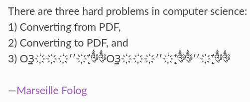

<!-- 
_class: title_slide
_paginate: skip
-->


{}

## <!--fit-->DATA 3464: Fundamentals of Data Processing
### <!--fit-->Wrangling text

Charlotte Curtis
March 5, 2026

{}

## Topic overview
- Text file formats and character encodings
- Extracting features from (un)structured text
- Regular expressions

**Resources used:**
- [Python documentation](https://docs.python.org/3/library/codecs.html#encodings-and-unicode)
- [Joel on Software Blog Post](https://www.joelonsoftware.com/2003/10/08/the-absolute-minimum-every-software-developer-absolutely-positively-must-know-about-unicode-and-character-sets-no-excuses/)

## What is a text file?
<!-- _class: code_reminder -->

- Any file is just a sequence of **bytes**
- The file **extension** is somewhat meaningless
- Text files contain only human-readable **characters**
- **Binary files** are everything else, including:
    - Images
    - PDFs
    - Word documents*
    - Executables

<footer>Technically word docs are just zip files with XML (structured text) inside</footer>

## Character encodings
<!-- _class: code_reminder -->

- To properly read a text file, we need to know its **encoding**
- Character encodings define how bytes are interpreted
- Turns out this is surprisingly [complicated](https://docs.python.org/3/library/codecs.html#encodings-and-unicode)

<footer>Quote from <a href="https://pikepdf.readthedocs.io/en/latest/topics/encoding.html#character-encoding">PikePDF documentation</a></footer>

## ASCII
- American Standard Code for Information Interchange (1963)
- 7-bit encoding (128 characters)
- First 32 are **control characters** (e.g., newline, tab)
- Then punctuation, digits, uppercase letters, lowercase letters
- Most computers use 8-bit bytes, so there's a whole 128 characters "left over"

> This is a very English-centric character set!

---

<footer><a href="https://xkcd.com/927/">https://xkcd.com/927/</a>

## Unicode to the rescue
- In the 1980s things were already getting out of hand
- The **Unicode consortium** published a standard in 1993 that assigned a **code point** to every character they could think of (297,334 as of Unicode 17.0)
- Currently, the most common encoding is [UTF-8](https://en.wikipedia.org/wiki/UTF-8)
    - "Unicode Transformation Format – 8-bit"
    - How can 297k characters be represented in only 8 bits?
- The first 128 characters are 1 byte each and align with ASCII
- After that, [2-4 bytes per character](https://en.wikipedia.org/wiki/Comparison_of_Unicode_encodings#Eight-bit_environments) are used
> There's also UTF-16 and UTF-32, but now we need to deal with [endianness](https://en.wikipedia.org/wiki/Endianness)

## Line endings
- Say we agree to use UTF-8 👍
- A text file is still just a big long string of **bytes**
- Humans like things to be orderly and readable with **line breaks**
    | System       | Abbreviation         | Escape sequence | Code point    |
    | ------------ | -------------------- | --------------- | ------------- |
    | Pre-OS X Mac | CR (carriage return) | `\r`            | U+000D        |
    | Unix         | LF (line feed)       | `\n`            | U+000A        |
    | Windows      | CRLF                 | `\r\n`          | U+000D U+000A |

- Result: chaos, but we've mostly settled on LF (`\n`)

## Why am I telling you all this?
- As data scientists, you will need to ingest data from various sources
- You **will** encounter character encoding and/or line ending issues
- You don't need to memorize all this, but recognizing that an issue exists will go a long ways towards fixing it