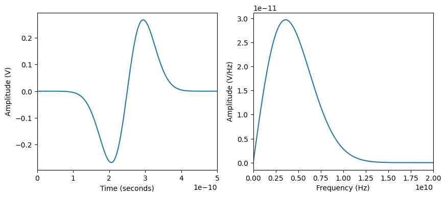

<!-- 
_class: title_slide
_paginate: skip
-->


{}

## <!--fit-->DATA 3464: Fundamentals of Data Processing
### <!--fit-->Signals and Audio

Charlotte Curtis
March 17, 2026

{}

## Topic overview
- Introduction to signals
- Audio as a 1D signal
- File formats
- A brief intro to signal processing

**Resources used:**
- Various textbooks from my undergrad
- [DSPguide.com](https://dspguide.com/) seems like a pretty good resource

## What is a signal?
<!-- _class: code_reminder -->
> "A [continuous/discrete] signal is a function of independent variables that range over [a continuum/discrete] values" - Jerry L. Prince, Medical Imaging Signals and Systems

- Common notation: $x(t)$ for continuous, $x[n]$ for discrete
- Signals are **discretized** by **sampling** at some fixed interval $dt$
- The **sampling rate** is informed by the frequency content of the data:
  $$f_s \ge 2 f_{max}$$
  (but in practice is much higher)

## Frequency content of a signal
- A discrete time domain signal can be represented as:
 $$x[n] = \sum_{k=0}^{N-1}\left[a_k\cos\left(\frac{2\pi k n}{N}\right) + b_k\sin\left(\frac{2\pi k n}{N}\right)\right]$$
- Or, using Euler's formula $e^{j\theta} = \cos\theta + j\sin\theta$:
  $$x[n] = \sum_{k=0}^{N-1}c_k e^{j\frac{2\pi k n}{N}}$$
  where the complex coefficients $c_k = a_k + jb_k$ and $j = \sqrt{-1}$

## Fourier Transform
- To figure out what the coefficients $c_k$ are, we can use the **Discrete Fourier Transform** (DFT):
  $$X[k] = \sum_{n=0}^{N-1}x[n]e^{-j2\pi \frac{k}{N} n}$$
  where each element of $X[k]$ is the coefficient $c_k$ for frequency $k$
- This can also be inverted to get back the original signal:
  $$x[n] = \frac{1}{N}\sum_{k=0}^{N-1}X[k]e^{j2\pi \frac{k}{N} n}$$

<footer>This is skipping over several entire math courses</footer>

## Where we left off on March 17
<!-- _class: title_slide -->

## Symmetry in the frequency domain
<!-- _class: code_reminder -->
- Since a real-valued signal in time is composed of both sine and cosine components, its DFT has **conjugate symmetry**
  $$X[N-k] = X[k]^*$$
  where $^*$ denotes the complex conjugate
- This means the **negative-frequency half** of the spectrum is redundant
- In practice, for real-valued data, we often only inspect:
  - **magnitude**: $|X[k]|$ to see "how much" of each frequency is present
  - **phase**: $\angle X[k]$ to see alignment/shift information

## Frequency vs Time Domains

- $f = \frac{1}{t} \implies$ short time = high frequency, small frequency = long time

## Example signal: Audio
<!-- _class: code_reminder -->
- Once you think of a signal as being a weighted sum of frequency components, you can do some fun things with it
- We can extract information, downsample, remove noise, etc
- Example: a typical .wav file
    - Uncompressed
    - 16 bits per sample (bit depth)
    - 48 kHz sampling rate
    - mono (1 channel) or stereo (2 channels)
> What about .mp3? .ogg? I would use [ffmpeg](https://www.ffmpeg.org/) to convert to .wav

## Preparing data
- Assuming we're starting with a collection of audio files, we can either:
  - Extract features and save as tabular data
  - Use the raw audio signal as input
- We can preprocess and store the data, or preprocess on the fly

> What considerations might go into this decision?
> What should always be stored regardless of the approach?

## Preparing audio data
<!-- _class: code_reminder -->

- Data for learning tasks is easiest to work with if it is **consistent**
- For audio signals, this could include:
    - Decompressing and converting to .wav
    - Downsampling
    - Aligning and cropping primary signal
    - Converting to mono/stereo
    - Extracting features
- [librosa](https://librosa.org/doc/latest/index.html) can help with this (and can apparently handle mp3 too!)

## Coming up next
- 2D signals (aka images)
- Strategies and software for labelling data

> By next week you should have some idea of what kind of dataset you want to curate and label for Assignment 3