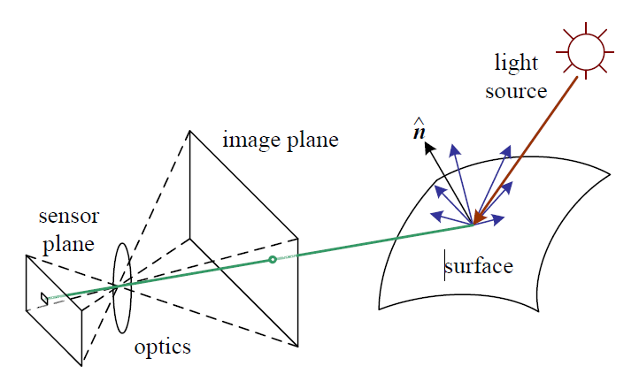

<!-- 
_class: title_slide
_paginate: skip
-->


{}

## <!--fit-->DATA 3464: Fundamentals of Data Processing
### <!--fit-->Image Processing

Charlotte Curtis
March 24, 2026

{}

## Topic overview
- Image representation
- File formats and compression
- Preprocessing for image recognition tasks

**Resources used:**
- [Computer Vision: Algorithms and Applications (2nd edition)](https://szeliski.org/Book/)
- [Pillow Documentation](https://pillow.readthedocs.io/en/stable/index.html)
- [A blog post on image compression](https://rosswoleben.com/projects/image-compression)
- [JPEG demo](https://cgjennings.ca/articles/jpeg-compression/)

## Images as 2D signals

- The light that enters a camera can be modelled as continuous signal:
  $$f(x, y),\space -\infty < x, y < \infty$$
- Digital images are sampled:
  $$f[n, m], \space n = n \Delta_x, m = n \Delta_y$$
  where typically $\Delta_x = \Delta_y$
- The area $\Delta_x \times \Delta_y$ is called a **pic**ture **el**ement, or **pixel**

<footer>Image is Figure 2.14 in <a href="https://szeliski.org/Book/">Computer Vision: Algorithms and Applications</a> by Richard Szeliski</footer>

## Image channels
- A photosensor responds to **light intensity** with an electrical signal
- Physical filters restrict the colour that reaches each sensor
- On most digital cameras, 1 sensor $\ne$ 1 pixel; it is instead **interpolated** to create a typical **3-channel image**
- ([Inexplicably](https://github.com/python-pillow/Pillow/discussions/5341), the Python imaging library Pillow uses the term "band")

 

<footer>Bayer sensor pattern diagram by <a href="https://en.wikipedia.org/wiki/User:Cburnett" class="extiw" title="en:User:Cburnett">en:User:Cburnett</a> - Own work, <a href="http://creativecommons.org/licenses/by-sa/3.0/" title="Creative Commons Attribution-Share Alike 3.0">CC BY-SA 3.0</a>, <a href="https://commons.wikimedia.org/w/index.php?curid=1496858">Link</a>

## Images as (3D) 2D arrays
<!-- _class: code_reminder -->
- Size (`np.shape`) usually defined as `[rows, cols, (channels)]`
- Typical 8-bit image: integers from 0 to 255
  - For processing, common to convert to float and **normalize**
- RGB examples of individual pixels: 
  - `[255, 0, 0]`
  - `[128, 128, 128]`
  - `[255, 255, 255]`

## Portable Network Graphics
- [PNG](https://en.wikipedia.org/wiki/PNG) is an image format released in 1996 as a GIF replacement
- Typically 8 bits per channel, but can be 1, 2, 4, 8, or 16
- 3x RGB channels, plus an optional alpha (transparency) channel
- Space saved in two ways:
  - Indexed colour, where numbers map to a finite set of colours
  - Lossless compression, e.g. `[0 0 0 0 0 0 0]` $\rightarrow$ `7 0`

> What kinds of images would benefit from this compression scheme?

## Joint Photographic Experts Group
- [JPEG](https://en.wikipedia.org/wiki/JPEG) is an image standard released in 1992 for photographic images
- **Lossy** compression based on human vision:
  1. Channels converted to [YCbCr](https://en.wikipedia.org/wiki/YCbCr) colourspace
  2. The colour components (Cb/Cr) are downsampled 2-3x
  3. Blocks of 8x8 pixels are transformed to frequency domain
  4. Amplitudes are [quantized](https://en.wikipedia.org/wiki/Quantization_(image_processing)) with larger buckets at higher frequencies
  5. Finally, lossless compression is applied
- The "quality" of a JPEG relates the degree of quantization

## A Cautionary Tale of Image Classification
- As convolutional neural networks (CNNs) gained popularity as image recognition powerhouses, people started using them for all sorts of things
- One example: predicting whether someone is a criminal based on a photo
- [Thoroughly debunked](https://arxiv.org/abs/2006.03895) in a paper that mentions, among other issues:
  - Criminal samples are all 8-bit greyscale PNG photographs of printed images, taken with the same camera
  - Non-criminals are RGB JPEGs from 5 different sources, converted to greyscale to be "compatible with mugshots from the criminal category"

> What's the problem here?