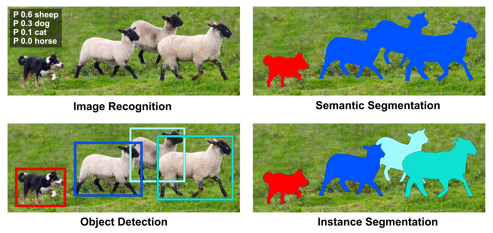

<!-- 
_class: title_slide
_paginate: skip
-->


{}

## <!--fit-->DATA 3464: Fundamentals of Data Processing
### <!--fit-->Data Labelling and Augmentation

Charlotte Curtis
April 2, 2026

{}

## Topic overview
- Tools for fancy labelling
- Annotation conventions
- Augmenting data

**Resources used:**
- [Label Studio](https://labelstud.io/)
- [Labelformat docs](https://labelformat.com/formats/object-detection/)
- [Coco Dataset Description](https://cocodataset.org/#format-data)

## Computer vision tasks

<footer>Image from https://manipulation.csail.mit.edu/segmentation.html</footer>

## How are annotations stored?
<!-- _class: code_reminder -->

Usually in plain text!
- Classification: subdirectories, csv files
- Bounding boxes: text files, e.g. COCO, VOC
- "Panoptic": Text and/or PNG, e.g. [COCO](https://cocodataset.org/#format-data)

> Examples downloaded from https://www.robots.ox.ac.uk/~vgg/data/pets/